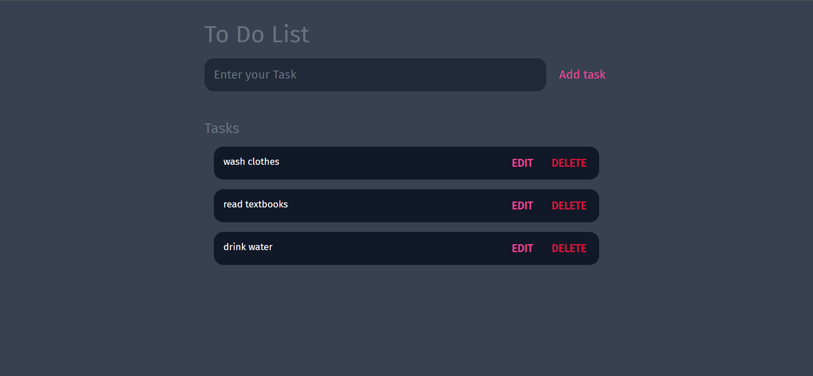
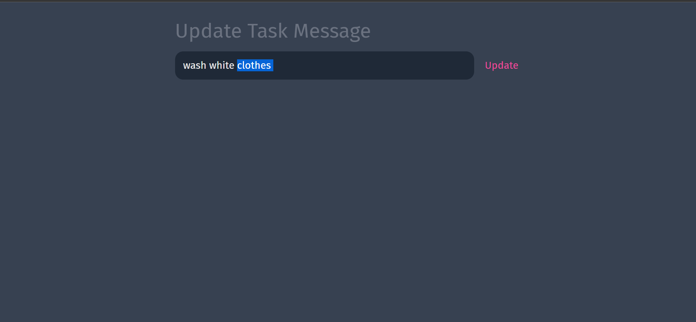
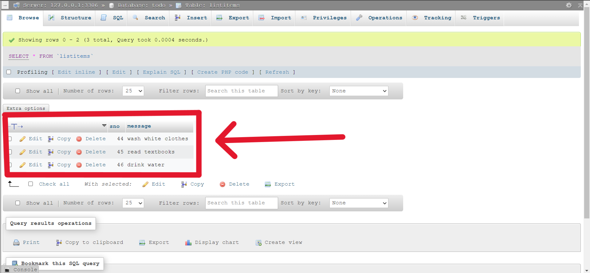

# To-Do-List-PHP

This is a website that manages your tasks.

## Functions
- <i>Add</i> your tasks to the lists.
- <i>Edit</i> your tasks.
- <i>Remove</i> task from the list.

## Back-End
- It saves your tasks in a database using My-SQL.
- `Database Name` : `todo`
- `Table Name` : `listitems`

## Screenshots

| Home Page | Update Page |
| --------- | --------- |
|  |  |

| My-SQL Database |
| --------------- |
|  |
